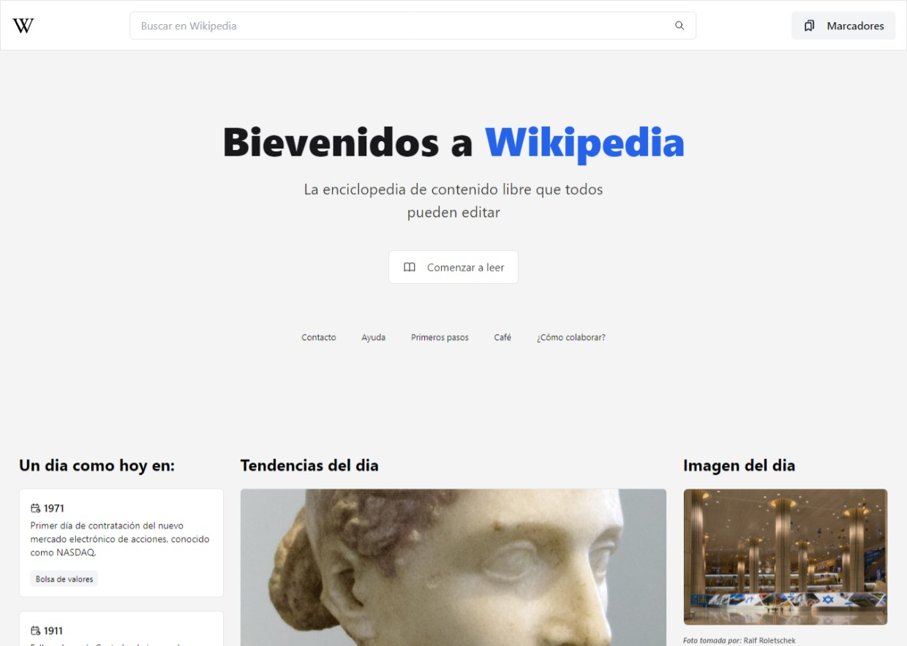

### TODOs

- [x] Ver si falta algun memo, useCallback
- [x] Random article, search results, marcadores item y card header son parecidos, ver  si puedo hacerlo un componente 
- [x] separar los componentes link  button
- [x] asegurarse de que cuando algo pierda el foco se cierre 
- [x] faltan skeletons
- [x] search input, hay 2 uno en marcadores y otros en el buscador, esto puede hacerse un componente solo el input
- [x] responsive
- [x] responsive navbar
- [x] VER SI PUEDO CREAR UN SECTION DIVIDER (tabs era) CUANDO SE PARA DISPOSITIVOS MOVILES OSEA, ESTO PARA EVITAR EL GRID RESPONSIVE - TRES LINKS, Y CAMBIAR DE COMPONENTE AL HACER CLICK
  - [x] TRENDING/EN ESTE DIA/IMGEN DEL DIA
- [x] Arreglar lo del buscador en modo responsivo

-----
### Services
- [x] Organizar los de los services, probar generando un unico fetcher usar eso y pasar la url en otra rama
